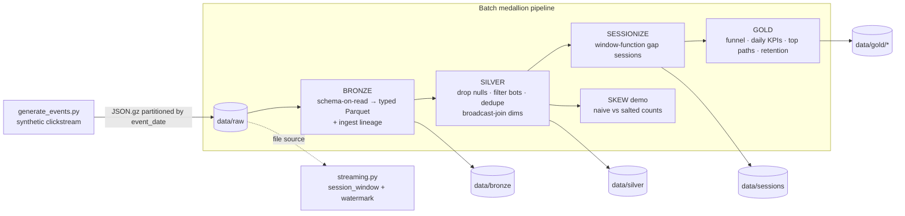

# Clickstream Sessionizer

A **PySpark lakehouse** that turns raw clickstream events into user **sessions**
and business analytics, built on a **bronze → silver → gold** medallion
architecture. The hero feature is **gap-based sessionization** implemented with
window functions — the exact technique used by Google Analytics / Adobe to group
a user's activity into visits.

It is written to run on a laptop against ~400k synthetic events, but every
transformation is a distributed Spark job that scales to billions of rows
unchanged.

---

## What it demonstrates

This project is a deliberate showcase of the techniques that come up when you
work with large distributed datasets:

| Technique | Where | Why it matters |
|---|---|---|
| **Gap-based sessionization** | [`sessionize.py`](src/clickstream_sessionizer/sessionize.py) | `lag()` + cumulative `sum()` over a per-user window to detect >30-min inactivity gaps and assign stable `session_id`s. No UDFs, no `collect` — pure SQL that runs on the cluster. |
| **Window functions** | `sessionize.py` | Ordered windows for `lag`, running windows for cumulative sums, partitioned windows for entry/exit path extraction via `min/max(struct(ts, path))`. |
| **Data-skew handling (salting)** | [`skew.py`](src/clickstream_sessionizer/skew.py) | Hot users (bots/power users) concentrate rows on a few keys. Two-phase **salted aggregation** spreads a hot key across N tasks, then recombines — with an equality check proving the result is identical to the naive version. |
| **Broadcast joins** | [`dims.py`](src/clickstream_sessionizer/dims.py) | Small country/device dimension tables joined with an explicit `broadcast()` hint → map-side join, no shuffle of the fact table. |
| **Partitioned Parquet** | every layer | Output physically partitioned by `event_date` for partition pruning on time-range queries. |
| **Adaptive Query Execution** | [`spark_session.py`](src/clickstream_sessionizer/spark_session.py) | AQE + skew-join enabled; documented alongside the *manual* salting so the trade-off is explicit. |
| **Structured Streaming** | [`streaming.py`](src/clickstream_sessionizer/streaming.py) | The same sessionization as a stream using built-in `session_window` with an event-time **watermark** and the `availableNow` trigger. |

---

## Architecture



- **Bronze** is a faithful, *typed* copy of the source with ingestion metadata —
  nothing is filtered, so silver/gold can always be recomputed without
  re-ingesting.
- **Silver** is the cleaned, conformed, deduplicated, bot-free, dimension-
  enriched event stream.
- **Sessions** is one row per visit (see schema below).
- **Gold** are the aggregate tables an analyst or dashboard queries.

---

## Session schema

`sessionize.build_sessions` produces one row per session:

| Column | Meaning |
|---|---|
| `session_id` | `sha2(user_id, session_index)` — stable and globally unique |
| `user_id` | user the session belongs to |
| `start_ts` / `end_ts` | first / last event time in the session |
| `duration_sec` | `end_ts - start_ts` in seconds |
| `num_events` / `num_pageviews` | activity counts |
| `entry_path` / `exit_path` | first / last URL path visited |
| `converted` | `true` if the session contains a `purchase` |
| `bounce` | `true` if the session has exactly one event |
| `event_date` | partition column (session start date) |

---

## How to run

Requirements: macOS/Linux, **Homebrew Python 3.11**, and a **Java 17 or 21**
runtime. PySpark **4.0.0** is pinned because it supports JDK 21 (Spark 3.5 does
not officially).

```bash
# 1. Create the venv and install deps
make venv
make install

# 2. Run the whole batch pipeline (generates data → bronze → silver → sessions → gold)
make pipeline

# 3. Run the tests
make test

# 4. Run the Structured Streaming variant (drains all input, then stops)
make stream
```

Individual layers are also targets: `make gen-data`, `make bronze`,
`make silver`, `make sessions`, `make gold`. `make clean` removes all generated
data and Spark artifacts.

You can scale the input on the CLI:

```bash
.venv/bin/python -m clickstream_sessionizer.pipeline all --events 1000000
```

> **Note on the worker interpreter:** the code pins `PYSPARK_PYTHON` /
> `PYSPARK_DRIVER_PYTHON` to the current interpreter so Spark's Python workers
> never mismatch the driver's minor version — a common local-Spark footgun.

---

## Sample output

Real output from `make pipeline` on ~400k synthetic events (a laptop run):

```
PIPELINE SUMMARY
  bronze : 401,419 rows
  silver : 311,781 rows      # bots + null-key + duplicate rows removed
  sessions: 47,202 rows
  gold tables: ['funnel', 'daily_sessions', 'top_paths', 'returning_users']
  status : OK
```

Funnel (note the realistic drop-off — ~21% add-to-cart, ~2.3% purchase):

```
+-------------+------+-------------------+
|stage        |count |rate_from_view     |
+-------------+------+-------------------+
|1_view       |171736|1.0                |
|2_add_to_cart|36572 |0.2129...          |
|3_purchase   |3869  |0.0225...          |
+-------------+------+-------------------+
```

Per-day session KPIs:

```
+----------+------------+--------------+----------------+-----------+---------------+
|event_date|num_sessions|distinct_users|avg_duration_sec|bounce_rate|conversion_rate|
+----------+------------+--------------+----------------+-----------+---------------+
|2026-08-01|15608       |8189          |666.1           |0.1349     |0.061          |
|2026-08-02|15788       |8351          |563.8           |0.1349     |0.0598         |
|2026-08-03|15806       |8311          |562.0           |0.1357     |0.0595         |
+----------+------------+--------------+----------------+-----------+---------------+
```

Skew diagnostics — the hottest user alone owns ~9,300 events, and the salted
aggregation reproduces the naive total exactly:

```
skew metrics: {'naive_total_events': 311781, 'salted_total_events': 311781,
               'totals_match': 1, 'hottest_user_events': 9285, 'salt_factor': 16}
```

---

## How sessionization works (the core idea)

```python
w = Window.partitionBy("user_id").orderBy("event_timestamp")
gap = unix_timestamp("event_timestamp") - unix_timestamp(lag("event_timestamp").over(w))

# A session boundary opens on the first event OR when the gap exceeds 30 min.
is_start = when(prev_ts.isNull() | (gap > 1800), 1).otherwise(0)

# Cumulative sum of boundaries = the user's session index (1, 2, 3, ...).
session_index = sum(is_start).over(w.rowsBetween(unboundedPreceding, currentRow))
session_id    = sha2(concat_ws("|", user_id, session_index), 256)
```

The only shuffle is the window's `partitionBy(user_id)`. Because a few hot users
dominate that key, `skew.py` demonstrates the salting pattern that keeps such a
shuffle from being bottlenecked on one straggler task.

---

## Scaling notes

Everything here is laptop-sized *data* but cluster-sized *code*:

- **No driver-side `collect` on the hot path.** Aggregations stay distributed;
  `collect` is only used on already-tiny result tables (funnel = 3 rows).
- **Partitioning** by `event_date` gives partition pruning; on a real cluster
  you'd also consider bucketing by `user_id` to avoid re-shuffling for the
  window.
- **Shuffle partitions** are fixed small for a laptop; on a cluster remove the
  override and let AQE coalesce dynamically.
- **Salting factor** and the hot-key threshold are config-driven so you can tune
  them to the observed skew.
- **Streaming** uses `session_window` with a watermark so session state is
  bounded; swap the `availableNow` trigger for `processingTime`/continuous in
  production.

---

## Project layout

```
clickstream-sessionizer/
├── conf/config.yaml                 # gap, paths, salting, partitioning, generator, spark
├── src/clickstream_sessionizer/
│   ├── config.py                    # typed config (frozen dataclasses)
│   ├── spark_session.py             # SparkSession builder (AQE, worker-python pin)
│   ├── generate_events.py           # synthetic clickstream w/ hot users + bots
│   ├── bronze.py                    # schema-on-read → typed Parquet + lineage
│   ├── silver.py                    # clean/dedupe/bot-filter + broadcast enrich
│   ├── dims.py                      # country/device dimensions (broadcast join)
│   ├── sessionize.py                # ★ gap-based sessionization (window functions)
│   ├── skew.py                      # skew demo + salted aggregation
│   ├── gold.py                      # funnel / daily KPIs / top paths / retention
│   ├── streaming.py                 # session_window streaming variant
│   └── pipeline.py                  # argparse CLI orchestrator
└── tests/                           # pytest: sessionize, silver, gold, skew
```

## License

MIT — see [LICENSE](LICENSE).
